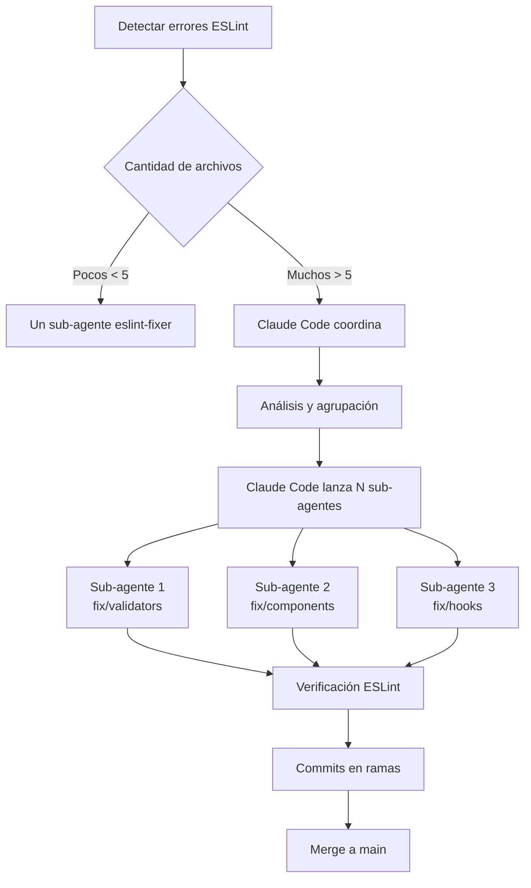

# Sub-Agentes para Corrección de ESLint

Este directorio contiene configuraciones de sub-agentes especializados para trabajar con el proyecto de Sistema de Gestión de Transporte.

## Sub-Agente Disponible

### `eslint-fixer` ✅

**Propósito**: Corregir errores y warnings de ESLint de manera autónoma
**Modelo**: Sonnet (optimizado para tareas de desarrollo y refactorización)

- Crea su propia rama de trabajo
- Aplica refactorizaciones siguiendo DRY/SOLID
- Verifica con ESLint y TypeScript antes de commitear
- NO usa `--no-verify` ni `eslint-disable`

## Uso Rápido

### Opción 1: Corrección Individual

Para corregir un conjunto específico de archivos:

```markdown
Usa el sub-agente eslint-fixer para corregir los siguientes archivos:

- frontend/src/components/forms/ClienteForm.tsx
- frontend/src/hooks/useClienteForm.ts

Crea la rama fix/cliente-forms y asegúrate de que pasen todas las validaciones.
```

### Opción 2: Corrección Paralela Automática

Para analizar y corregir todo el proyecto:

```bash
# 1. Ejecutar script de análisis
node scripts/launch-eslint-agents.js

# 2. Revisar los prompts generados en eslint-fixes/

# 3. Lanzar sub-agentes con Task tool usando los prompts generados
```

### Opción 3: Coordinación desde Claude Code (RECOMENDADO)

Gestiona todo desde la sesión principal:

```markdown
Necesito corregir errores de ESLint en el frontend.

PROCESO:

1. Ejecuta cd frontend && npm run lint
2. Agrupa archivos por dominio/funcionalidad
3. Lanza múltiples @eslint-fixer usando Task tool EN PARALELO
4. Cada sub-agente debe crear su rama fix/[grupo]
5. Consolida resultados al final
```

## Ejemplo de Prompt para Claude Code

### Para un sub-agente individual:

```markdown
@eslint-fixer

Corrige los siguientes archivos que tienen warnings de ESLint:

- frontend/src/validators/viajeValidator.ts (complejidad cognitiva alta)
- frontend/src/validators/clienteValidator.ts (strings duplicados)

Importante:

- Crea tu propia rama fix/validators
- Aplica refactorizaciones reales, no solo suprimas warnings
- Verifica que pasan ESLint y TypeScript
- Haz commit cuando termines
```

### Para coordinar múltiples sub-agentes (desde Claude Code):

```markdown
Necesito corregir todos los errores de ESLint en el frontend.

TU TRABAJO (Claude Code - Sesión Principal):

1. Ejecuta npm run lint para analizar
2. Agrupa archivos de manera inteligente
3. Lanza sub-agentes @eslint-fixer usando Task tool (máximo 5)
4. Cada uno en su rama fix/[grupo]
5. Consolida resultados cuando terminen

USA Task tool múltiples veces en un solo mensaje para paralelización.
```

## Flujo de Trabajo Actualizado



## Configuración del Proyecto

Los sub-agentes están configurados para trabajar con:

- **ESLint**: Reglas estrictas con SonarJS
- **TypeScript**: Modo strict
- **Husky**: Pre-commit hooks con `--max-warnings 0`
- **Prettier**: Formateo automático

## Mejores Prácticas

1. **Siempre crear ramas**: Cada sub-agente debe trabajar en su propia rama
2. **Verificar antes de commit**: Ejecutar ESLint y TypeScript checks
3. **Refactorizar, no suprimir**: Corregir la causa raíz, no ocultar warnings
4. **Commits descriptivos**: Explicar qué se corrigió y cómo
5. **Trabajo incremental**: Commitear frecuentemente grupos pequeños

## Troubleshooting

### Si un sub-agente falla:

1. Verificar que creó su rama correctamente
2. Revisar si hay conflictos con otros sub-agentes
3. Comprobar que tiene las herramientas necesarias habilitadas
4. Verificar que está siguiendo las instrucciones del system prompt

### Si los commits son bloqueados:

1. NO usar `--no-verify`
2. Corregir TODOS los warnings, no solo los errores
3. Verificar con `npx eslint --max-warnings 0 [archivo]`
4. Asegurarse de que TypeScript también pasa

## Scripts de Utilidad

- `scripts/launch-eslint-agents.js`: Analiza y genera prompts automáticamente
- Modo dry-run: `node scripts/launch-eslint-agents.js --dry-run`
- Limitar agentes: `node scripts/launch-eslint-agents.js --max-agents=3`

## Notas Importantes

- **Modelo configurado**: `eslint-fixer` usa Sonnet para tareas de desarrollo eficientes
- Cada sub-agente tiene su propio contexto independiente
- Los prompts deben ser autosuficientes con toda la información necesaria
- Se recomienda verificar el trabajo de cada sub-agente antes de hacer merge

## Configuración del Sub-agente

| Sub-agente   | Modelo | Razón                                                                   |
| ------------ | ------ | ----------------------------------------------------------------------- |
| eslint-fixer | Sonnet | Ideal para tareas de desarrollo, refactorización y corrección de código |
